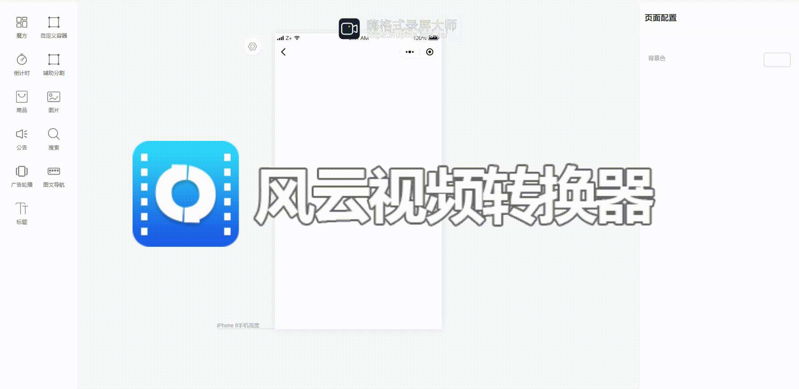

## 开发缘由

  最近在使用作者的mall-cook开源项目，发现其欠缺小程序项目海报，活动页自由布局的功能。于是对其进行了简单的扩展，希望可以给其他有需要小伙伴提供一个解决方案，也希望其他小伙伴如果有更好的思路也可以跟我联系分享~

## 扩展功能
<figcaption style="margin-top: 10px;margin-bottom: 10px; text-align: center; color: #888; font-size: 14px;">容器功能演示</figcaption>

## 使用说明
将packages下的mall-cook-platform，mall-cook-template两个包覆盖你的项目即可，如有疑问可以跟我联系。